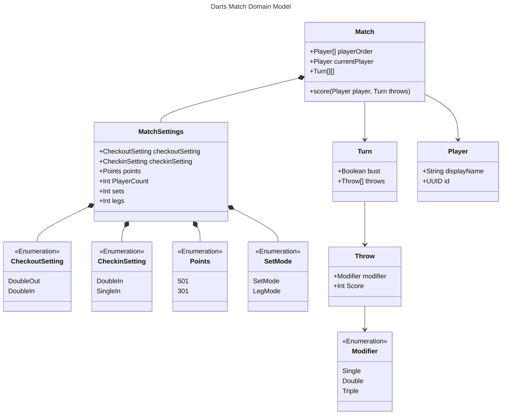

```mermaid
---
title: Darts Match Domain Model
---
classDiagram
    Match *-- MatchSettings
    MatchSettings *-- CheckoutSetting
    MatchSettings *-- CheckinSetting
    MatchSettings *-- Points
    MatchSettings *-- SetMode
    Match --> Turn
    Match --> Player
    Turn --> Throw
    Throw --> Modifier
    
    class Match {
        +Player[] playerOrder
        +Player currentPlayer
        +Turn[][]
        +score(Player player, Turn throws)
    }

    class Player {
        +String displayName
        +UUID id
    }

    class MatchSettings {
        +CheckoutSetting checkoutSetting
        +CheckinSetting checkinSetting
        +Points points
        +Int PlayerCount
        +Int sets
        +Int legs
    }

    class Turn {
        +Boolean bust
        +Throw[] throws
    }

    class Throw {
        +Modifier modifier
        +Int Score
    }
    
    class Modifier {
        <<Enumeration>>
        Single
        Double
        Triple
    }

    class Points {
        <<Enumeration>>
        501
        301
    }

    class CheckoutSetting {
        <<Enumeration>>
        DoubleOut
        DoubleIn
    }

    class CheckinSetting {
        <<Enumeration>>
        DoubleIn
        SingleIn
    }

    class SetMode {
         <<Enumeration>>
         SetMode
         LegMode
    }
```